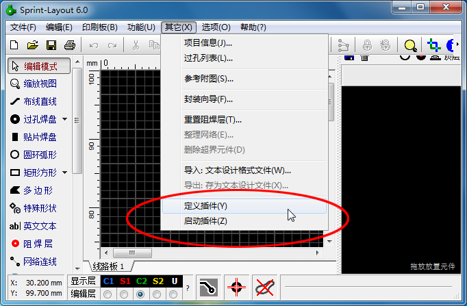
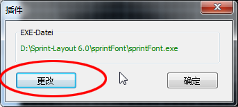
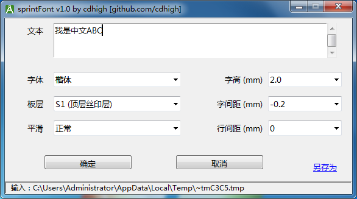
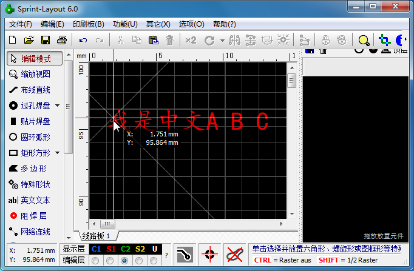
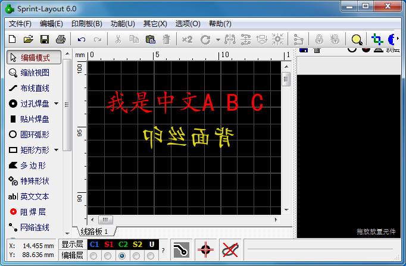
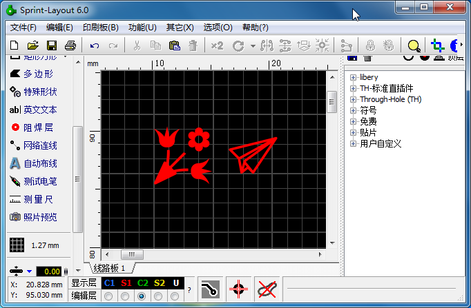

# sprintFont 使用手册
sprintFont 是 Sprint-Layout v6 2022版 的一个插件，用于直接往PCB中添加中文字体    

除直接插入中文字符外，需要特殊符号的可以使用一些软件或网站先将SVG生成ttf/otf字体文件    
[阿里巴巴矢量图标库](https://www.iconfont.cn) 或类似的网站提供很多特殊符号可供直接下载    

## 1. 使用方法

### 1.1 插入汉字或其他字体的文字
1. 将sprintFont解压缩到某一个目录，打开Sprint-Layout 6.0 2022版，选择菜单“其他”|“定义插件”

2. 定位到sprintFont.exe

3. 需要插入中文文本时选择菜单“其他”|“启动插件”
主界面上除文本框外，有六个选项，自己试一下就都明白了    
需要注意的是字间距，一般中文可以设置为负数，因为中文字框外围留空较多，负数可以让字紧靠一些，既美观又节省宝贵的PCB空间，而英文的字框比较小，需要设置为正数，否则可能会相互重叠，不同的字体文件需要的数值可能不同    

4. 确认参数后点击确定回到Sprint-Layout，您输入的文字会“粘”在鼠标上，移动到需要的位置点击鼠标即可放下

选择“底层覆铜层”或“底层丝印层”后字体自动水平镜像   

5. 如果您的字体里面有特殊符号的话，也可以插入特殊符号，方法是在文本框输入格式“\u1234”(将1234替换为对应符号的unicode编码)

一个例子，到阿里图标网站 （<https://www.iconfont.cn>） 上随便选择两个符号添加到项目，然后下载到本地，将压缩包内的iconfont.ttf拷贝到本软件目录下，在iconfont.json里面找到这两个符号的unicode编码分别为“e62a/e6ae”（每个人下载的编码不同），启动此插件，选择字体为iconfont，文本框中输入“**\ue62a\ue6ae**”，即可将对应的符号插入PCB

### 1.2 导入Kicad的封装库

免责声明：因为使用本软件导入的封装不正确导致的任何损失，本人不承担任何责任，如不认可此免责声明，请立刻停止使用此软件
注1：Kicad的文本默认居中对齐，Sprint-Layout的文本左对齐，而无法计算文本的实际占用长度，如果在加上旋转，情况就更复杂了，所以导入后的文本信息需要手工再调整    
注2：Kicad和Sprint-Layout的焊盘无法一一对应，针对一些特殊形状焊盘，可能需要手工修改   
注3：Kicad相比Sprint-Layout有更多的电路板层，所以导入后可能有些信息会堆叠起来     

## 您可能希望了解的其他内容
1. Sprint-Layout通过临时文件和插件通讯，如果启动插件时你什么元件都没有选中，则Sprint-Layout会导出PCB中所有元件到临时文件，如果您的PCB比较大的话，会生成一个比较大的临时文件，这是没有必要的花销。所以建议先选择任意一个元件，然后再启动插件，则Sprint-Layout仅导出一个元件到临时文件，执行效率会高很多   
2. 软件支持所有的TrueType/OpenType字体，所以也可以用于插入Sprint-Layout不直接支持的其他英文字体/艺术字体    
3. 如果您选择的字体文件里面缺少您输入的字形，根据字体文件不同，则对应字符位置为空或乱码    
4. 软件支持多行文本输入   
5. 除了使用Sprint-Layout通过插件模式调用外，也可以单独执行，单独执行后“确定”按钮无效，可以使用“另存为”按钮将生成的符号文件保存到一个文本文件，之后可以使用Sprint-Layout的“导入：文本设计格式文件”功能单独导入，效果一样   
6. 软件支持中英文界面，启动时自动识别系统语种，如果需要手动切换，可以在config.json里面添加一个配置项：   
<code>"language": "en"</code>
<code>"language": "zh-cn"</code>

