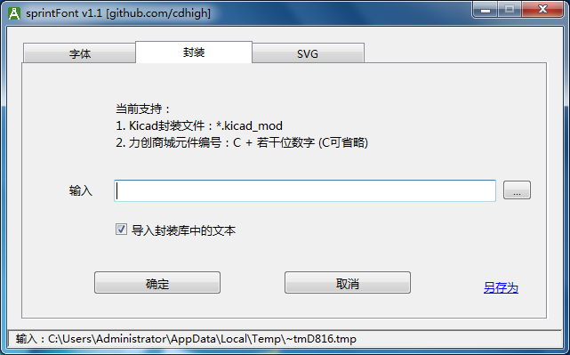
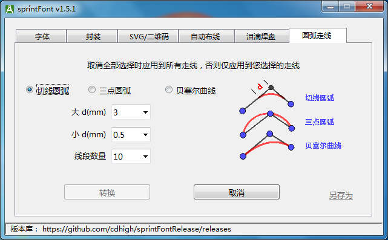

# sprintFont 使用手册
sprintFont 是 Sprint-Layout v6 2022及以上版本 的一个插件     

Compiled releases and English readme: <https://github.com/cdhigh/sprintFontRelease>   

## 1. 特性列表
* 输入汉字和其他字体的文本
* 导入Kicad/力创EDA的封装
* 插入SVG图像
* 插入二维码
* 支持自动布线
* 插入泪滴焊盘
* 生成圆弧走线

## 2. 使用方法

### 2.1 安装插件
1. 将sprintFont解压缩到某一个目录，打开Sprint-Layout v6.0 2021及以上版本，选择菜单 [“其他” / “定义插件”]

2. 点击“更改”按钮，定位到您解压的sprintFont.exe

3. 需要插件功能时选择菜单 [“其他” / “启动插件”]，或使用快捷键“Alt-X-Z”

### 2.2 插入汉字或其他字体的文字

1. 切换到“字体”页面

主界面上除文本框外，有六个选项，自己试一下就都明白了    
需要注意的是字间距，一般中文可以设置为负数，因为中文字框外围留空较多，负数可以让字紧靠一些，既美观又节省宝贵的PCB空间，而英文的字框比较小，需要设置为正数，否则可能会相互重叠，不同的字体文件需要的数值可能不同    

2. 确认参数后点击确定回到Sprint-Layout，您输入的文字会“粘”在鼠标上，移动到需要的位置点击鼠标即可放下

选择“底层覆铜层”或“底层丝印层”后字体自动水平镜像   

3. 如果字体里面有特殊符号，也可以插入特殊符号，方法是在文本框输入格式“\u1234”(将1234替换为对应符号的unicode编码)

一个例子，到阿里图标网站（<https://www.iconfont.cn>） 上随便选择两个符号添加到项目，然后下载到本地，将压缩包内的iconfont.ttf拷贝到本软件目录下，在iconfont.json里面找到这两个符号的unicode编码分别为“e62a/e6ae”（每个人下载的编码不同），启动此插件，选择字体为iconfont，文本框中输入“**\ue62a\ue6ae**”，即可将对应的符号插入PCB

### 2.3 导入Kicad/立创EDA的封装库

免责声明：因为使用本软件导入的封装不正确导致的任何损失，本人不承担任何责任，如不认可此免责声明，请立刻停止使用此软件

1. **需要导入Kicad/立创EDA的封装库时点击切换到“封装”页面**

2. **导入Kicad的封装库**

Kicad是开源的，所有的资料都是公开的，全世界的爱好者都能贡献自己绘制的封装库，所以其封装库质量还不错。    
Kicad自带很多封装库，如果不想安装Kicad，也可以仅仅下载封装库 [官方封装库链接](https://gitlab.com/kicad/libraries/kicad-footprints)，除此之外，很多元件搜索网站也提供Kicad格式的封装库下载，比如 [Component Search Engine](https://componentsearchengine.com)。    

**步骤：**    
点击文本框右边的按钮浏览本机磁盘目录，选择对应的kicad_mod文件就可以导入到Sprint-Layout，同时兼容Kicad_v5封装和Kicad_v6封装格式     

3. **导入立创EDA的封装库**

据说立创EDA的封装库元件数量已经超过1百万了，这是一个宝藏，要物尽其用，我们不借来用用就可惜了～   
本工具同时支持导入立创EDA格式的封装，立创的封装数据库到目前为止是可以公开使用的，但不保证以后还是一直会公开，立创如果以后加入了“反爬”手段或隐藏元件编码的话，此功能会失效，所以且用且珍惜吧。    

**步骤：**    
如果要导入立创EDA的封装，首先需要找到对应元件的立创商城编号，可以到 [立创EDA网站](https://lceda.cn/editor)， 在项目页面点击左侧导航条的“元件库”，然后就可以搜索或浏览元件库了，选择某个元件后，在页面下方可以找到其编号     

在本工具的文本框里面输入找到的编号，直接回车或点击“确认”按钮，然后就是见证奇迹的时刻了～    

**注1.** 封装导入到Sprint-Layout后如果有些元素需要修改，可以双击元件，点击属性对话框的“置为对象”，然后再右键“组件解锁”，进行适当编辑后再“另存为元件”或右键选择“元件”重新将其组合为元件   
**注2.** Kicad/立创的文本默认居中对齐，Sprint-Layout的文本只能左对齐，而无法计算文本的实际占用长度，如果再加上旋转，情况就更复杂了，所以导入后的文本信息位置可能需要手工再调整    
**注3.** Kicad/立创的焊盘类型都很丰富，和Sprint-Layout的焊盘无法一一对应，针对一些特殊形状焊盘，可能需要手工修改     
**注4.** Kicad/立创相比Sprint-Layout有更多的电路板层，所以导入后可能有些信息会堆叠起来，有些板层的信息也无法导入      
**住5.** Kicad/立创有更多的绘图元素，有些特殊元素也无法导入    
**注6.** 立创封装库保存在力创的服务器，导入时需要访问互联网，中文系统默认使用中国节点(<https://lceda.cn>)，其他语种使用国际节点(<https://easyeda.com>)，如果希望手动切换，可以修改配置文件的配置项"easyEdaSite"，可选值为"cn"/"global"     

### 2.4 导入SVG矢量图像（实验性功能）

本工具同时支持SVG矢量图导入，但内部没有实现全部的SVG特性，所以只能支持比较比较简单的矢量图，比如LOGO之类的，并且如果使用多边形模式的话，很多图形都不能得到正确的结果，线条模式算法的适应能力会比较强一些。     
此功能对结果不做任何保证，如果导入结果不正确，直接放弃此功能好了，不需要提有关此功能的BUG报告。     
上面提到的阿里矢量图标网站(<https://www.iconfont.cn>)就可以直接下载SVG格式的图标文件。    

左边为矢量图用线条模式导入的效果，右边为同一个矢量图用多边形模式导入的效果

### 2.5 自动布线

这个插件尝试更进一步，给Sprint-Layout增加自动布线功能。    
实现方案和Kicad一样，分成三个步骤：
1. 导出为DSN文件   
2. 使用开源自动布线软件[Freerouting](https://github.com/freerouting/freerouting/releases)进行自动布线并将布线结果保存为SES文件   
3. 将SES文件导入到Sprint-Layout   

#### 2.5.1 使用方法

2.5.1.1 **导出自动布线DSN文件**

1. 在Sprint-Layout里面先切换到U层，定义一个封闭的线路板外框，可以为不同的形状比如矩形圆形或不规则图形，完成后切换到其他板层放置元件并适当布局，根据电路图，使用“网络连线”工具将需要连接的管脚连接起来，这个连线在不同的软件里面叫鼠线(Ratsnest)或飞线(Airwire)或其他名称

2. 在Sprint-Layout里面取消选择（不能选择任何元件或连线），启动插件，切换至“自动布线”选项页

3. 选择需要保存的DSN文件，通过双击布线规则条目来修改其数值，点击“导出DSN”按钮来导出DSN文件。   
除了DSN文件外，本插件还同时生成一个同名的pickle文件，请不要删除，此文件在导入SES时需要用到

2.5.1.2 **自动布线**

1. [下载安装Freerouting](https://github.com/freerouting/freerouting/releases)，使用Freerouting打开您导出的DSN文件

2. 点击Freerouting上方工具栏的“自动布线”，等待其完成布线，如果线路板比较复杂，可能需要运行比较长的时间    
可以通过启动时的命令行参数“oit”调节其优化算法的门限，可以更快完成或产生更好的布线结果

3. 默认为双面板，顶层和底层铜箔都允许走线，如果需要单面板布线，可以通过Freerouting菜单 [“参数” / “自动布线”] 对话框选择您需要的铜箔层

4. 布线完成后，通过菜单 [“文件” / “导出.ses文件”] 将布线结果保存为DSN同名的SES文件

2.5.1.3 **将布线结果导入Sprint-Layout**

1. 选择正确的SES文件后（需要保证同名的pickle文件存在），点击“导入SES”即可以将布线后的结果直接导入到Sprint-Layout。Sprint-Layout不一定需要预先打开之前的电路板，可以是一个空白电路板。

2. 按住Shift再点击“导入SES”则显示一个导入选项菜单，提供更多导入选择。

* **导入全部（删除已经布线成功的网络连接线）**: 默认选项，有铜箔连通的网络连接线被删除，没有铜箔连通的网络连接线被保留
* **导入全部（删除所有网络连接线）**: 将布线结果和元件全部导入并替换电路板上的所有元件，同时删除全部网络连接线（未完成布线的网络连接线也一并被删除）
* **导入全部（保留所有网络连接线）**: 导入布线结果和元件并替换电路板上的所有元件，同时保留网络连接线（已完成布线的网络连接线也被保留，需要你自己在Sprint-Layout里面逐一确认并手工删除）
* **仅导入自动布线的铜箔走线**: 导入走线，不导入元件，不删除电路板上的任何元素，导入的走线会“粘”在鼠标上，需要您移动到对应的位置放下

#### 2.5.2 自动布线其他细节说明
* 如果DSN文件同一目录下有同名的.rules文件，则Freerouting会使用此文件覆盖DSN文件中的布线规则，所以根据您的需要来确定是否要删除.rules文件
* 元件只能放在正面。如果是贴片元件，则元件和焊盘都在正面。如果是插件元件，则元件本体在正面，单面焊盘在反面（默认放置插件元件时就是这样的），如果是双面焊盘（过孔镀铜）则正面反面都可以。
* 如果部分区域不希望Freerouting走线，则可以画一个多边形，然后设置为“禁止区”。或者在U层画封闭多边形也能达到同样效果，但U层的多边形多影响到最终电路板外形。
* 如果您使用“组件解锁”功能修改了元件的焊盘丝印之类的属性，则需要在右键菜单先点击“组件锁定”再右键菜单点击“元件...”，将其转换为一个元件，否则导出时Freerouting仅显示焊盘，不显示丝印。（但是不影响布线和重新导入，丝印不会丢失）
* 电源线需要更粗的走线怎么办？预先布好电源线就好。同样的，如果有一些关键的线，比如时钟线之类的也可以预先布好，再让Freerouting布剩下的线。另一个方法是等Freerouting完成后再手工修改。所以根据需要，自动布线既可以当作布线的起点，也可以当作布线的终点。
* 因Freerouting的功能限制，丝印线条只能是水平垂直或45度斜线，其他角度会绘制错误，不过丝印不影响布线，重新导入到Sprint-Layout的显示是正常的。
* 因Freerouting的功能限制，缺少圆弧功能，所以丝印的圆弧没有绘制。
* 有时候正常导入SES时会发现已经走线的网络连接线没有被删除，这是Sprint-Layout的一个BUG，新建一个空白电路板再导入即可正常。

### 2.6 泪滴焊盘

泪滴焊盘算法的主要代码来自 <https://github.com/NilujePerchut/kicad_scripts>，特此鸣谢。

#### 2.6.1 基本操作
1. 在Sprint-Layout中先取消全部选择然后再执行此插件，则为整板添加泪滴焊盘，如果仅需要某些焊盘添加泪滴，则可以框选对应的焊盘和走线（需要同时选择焊盘和走线，单独走线和焊盘都不行）。删除泪滴焊盘也一样的操作，可以整板删除或仅删除被框选的部分。
2. 通过界面中的图例，应该比较容易理解三个参数的意义，百分比的基准是焊盘外径。

#### 2.6.2 设计细节
* 十字焊盘/和铺铜直接连接的焊盘都不会被添加泪滴焊盘
* 如果泪滴参数一致，即使多次执行添加泪滴焊盘命令，同一个焊盘也不会被重复添加泪滴焊盘，但如果参数不同，则多次执行可能会添加一些重叠的泪滴焊盘

### 2.7 圆弧走线
这个功能可以将普通的各种角度的走线转换为圆弧走线，很适合高频电路和音响电路。

#### 2.7.1 基本操作
1. 在Sprint-Layout中先取消全部选择然后再执行此插件，则尝试将整板所有符合条件的走线转换为圆弧走线，如果仅需要转换某些走线，则可以先选择对应的走线。
2. 插件支持三种转换圆弧走线的方式：
    * 切线圆弧：离走线转折点指定距离的两个点为切点为圆弧的起点和终点，圆弧和两段走线相切，提供两个距离，优先使用大距离，如果线段短于大距离，则使用小距离
    * 三点圆弧：两段走线共三个点，根据这三个画一个圆弧，三个点均在圆弧上
    * 贝塞尔曲线：第一个点为起点，第三个点为终点，两段走线的交点为控制点，绘制一个二阶贝塞尔曲线

#### 2.7.2 设计细节
1. 如果一根走线有很多转折，则会从起点开始每3点尝试转换为圆弧，如果不符合条件则跳过继续往后找合适的点，所以根据你的参数设定，可能会有些点不会被转换
2. 被同一板层的焊盘和多边形覆盖的走线上的点被认为为不符合生成圆弧的点，但是需要你同时选择对应焊盘和多边形，因为插件对你的选择范围外的元素一无所知

## 3. 您可能希望了解的其他内容
1. Sprint-Layout通过临时文件和插件通讯，如果启动插件时你什么元件都没有选中，则Sprint-Layout会导出PCB中所有元件到临时文件，否则只会导出被选择的元件。     
2. 除了使用Sprint-Layout通过插件模式调用外，也可以单独执行，单独执行后“确定”按钮无效，可以使用“另存为”按钮将生成的符号文件保存到一个文本文件，之后可以使用Sprint-Layout的 **“导入：文本设计格式文件”** 功能单独导入，效果一样   
3. 软件支持中英文界面，启动时自动识别系统语种，如果需要手动切换，可以在config.json里面修改 ("language":"en/zh-ch/es/pt/fr/ru/tr")    
4. 如果插件无法执行，请下载安装VC运行库2015/2017/2019/2022（任意一个版本均可），如果还不行，可能还需要“Windows 通用 C 运行库（Universal C Runtime）”，下载链接可以自己搜索，或者直接使用下面的链接：    
* [VC运行库 32位](https://aka.ms/vs/17/release/vc_redist.x86.exe)
* [VC运行库 64位](https://aka.ms/vs/17/release/vc_redist.x64.exe)
* [Windows通用C运行库（Universal C Runtime）](https://support.microsoft.com/en-us/topic/update-for-universal-c-runtime-in-windows-c0514201-7fe6-95a3-b0a5-287930f3560c)
5. 关于防病毒软件误报，因为这个程序是使用Python开发然后打包而成，这个打包机制容易导致部分特别敏感的防病毒软件产生误报，如果你有疑虑的话，可以将文件上传到 [VirusTotal](https://www.virustotal.com/) 或类似网站上查毒确认，或自己安装Python然后直接执行源码。    

## 4. 版本更新日志
### v1.6.1
* 使用AI自动翻译，添加法语，西班牙语，葡萄牙语，俄语，土耳其语翻译

### v1.6
* 1. 新特性：支持反转字体背景（负像）
* 2. 修正字间距和行间距为正值时排版错误的问题

### v1.5.5
* 支持添加贴片焊盘的泪滴(实验性功能)

### v1.5.4
* 支持Kicad封装格式Version 7/8
* 增加字体预览功能
* 导入Kicad_mod出错时显示更多的错误信息

### v1.5.3
* 修正力创EDA导入封装的一个name属性设置错误
* 额外编译一个支持Windows XP的版本

### v1.5.2
* 支持所有元素的"NAME"属性（Sprint-Layout v6 08.07.2022更新版本开始支持）
* 支持Windows10及以上系统的用户字体
* 修正 "楷体_GB2312" 缺笔画的问题

### v1.5.1
* 切线圆弧走线提供两个距离，如果大距离不满足，则使用小距离    

### v1.5
* 添加圆弧走线功能

### v1.4
* 新增插入泪滴焊盘功能

### v1.3
* 新增自动布线功能（导出为DSN格式后使用Freerouting进行自动布线）
* 新增支持ttc/otc格式的字体文件
* 其他一些细节的优化

### v1.2
* 新增支持生成二维码功能

### v1.1
* 新增支持导入Kicad/立创EDA的封装库
* 新增实验性的SVG导入功能

### v1.0
* 初始版本，支持汉字和其他自定义字体的文本插入
