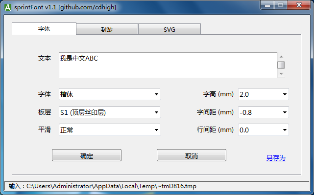

# sprintFont 使用手册
sprintFont 是 Sprint-Layout v6 2022版 的一个插件，用于直接往PCB中添加中文字体和导入Kicad/立创EDA的封装     

适用版本：v1.1

## 1. 使用方法

### 1.1 插入汉字或其他字体的文字
1. 将sprintFont解压缩到某一个目录，打开Sprint-Layout 6.0 2022版，选择菜单“其他”|“定义插件”

2. 定位到sprintFont.exe

3. 需要插入中文文本时选择菜单“其他”|“启动插件”
主界面上除文本框外，有六个选项，自己试一下就都明白了    
需要注意的是字间距，一般中文可以设置为负数，因为中文字框外围留空较多，负数可以让字紧靠一些，既美观又节省宝贵的PCB空间，而英文的字框比较小，需要设置为正数，否则可能会相互重叠，不同的字体文件需要的数值可能不同    

4. 确认参数后点击确定回到Sprint-Layout，您输入的文字会“粘”在鼠标上，移动到需要的位置点击鼠标即可放下

选择“底层覆铜层”或“底层丝印层”后字体自动水平镜像   

5. 如果字体里面有特殊符号，也可以插入特殊符号，方法是在文本框输入格式“\u1234”(将1234替换为对应符号的unicode编码)

一个例子，到阿里图标网站 （<https://www.iconfont.cn>） 上随便选择两个符号添加到项目，然后下载到本地，将压缩包内的iconfont.ttf拷贝到本软件目录下，在iconfont.json里面找到这两个符号的unicode编码分别为“e62a/e6ae”（每个人下载的编码不同），启动此插件，选择字体为iconfont，文本框中输入“**\ue62a\ue6ae**”，即可将对应的符号插入PCB

**注1.** 软件支持所有的TrueType/OpenType字体，所以也可以用于插入Sprint-Layout不直接支持的其他英文字体/艺术字体    
**注2.** 如果希望插入图片，有很多软件可以将图片转换为矢量图，然后再转换为字体文件    
**注3.** 如果您选择的字体文件里面缺少您输入的字形，根据字体文件不同，则对应字符位置为空或乱码    
**注4.** 软件支持多行文本输入   

### 1.2 导入Kicad/立创EDA的封装库

免责声明：因为使用本软件导入的封装不正确导致的任何损失，本人不承担任何责任，如不认可此免责声明，请立刻停止使用此软件

1. **需要导入Kicad/立创EDA的封装库时点击切换到“封装”页面**

2. **插入Kicad的封装库**

Kicad是开源的，所有的资料包括 [封装库格式](https://dev-docs.kicad.org/en/file-formats/sexpr-intro/index.html#_footprint) 都是公开的，全世界的爱好者都能贡献自己绘制的封装库。    
Kicad自带很多封装库，如果不想安装Kicad，也可以仅仅下载封装库 [Gitlab官方封装库链接](https://gitlab.com/kicad/libraries/kicad-footprints)，除此之外，很多元件搜索网站也提供Kicad格式的封装库下载，比如 [Component Search Engine](https://componentsearchengine.com)。    

**步骤：**    
点击文本框右边的按钮浏览本机磁盘目录，选择对应的kicad_mod文件就可以导入到Sprint-Layout，同时兼容Kicad_v5封装和Kicad_v6封装格式     

3. **插入立创EDA的封装库**

据说立创EDA的封装库元件数量已经超过1百万了，不借来用用就可惜了～～～     
本工具同时支持导入立创EDA格式的封装，嘉立创还算是有情怀的公司，立创的封装数据库到目前为止是可以公开使用的（[封装库格式](https://docs.lceda.cn/cn/DocumentFormat/EasyEDA-Format-Standard/index.html)），但不保证以后还是一直会公开，立创如果以后加入了“反爬”手段或隐藏元件编码的话，此功能会失效，所以且用且珍惜吧。    

**步骤：**    
如果要插入立创EDA的封装，首先需要找到对应元件的立创商城编号，可以到 [立创EDA网站](https://lceda.cn)， 在项目页面点击左侧导航条的“元件库”，然后就可以搜索或浏览元件库了，选择某个元件后，在页面下方可以找到其编号     

在本工具的文本框里面输入找到的编号，直接回车或点击“确认”按钮，然后就是见证奇迹的时刻了～    

**注1.** 封装导入到Sprint-Layout后如果有些元素需要修改，可以双击元件，点击属性对话框的“置为对象”，然后再右键“组件解锁”，进行适当编辑后再“另存为元件”   
**注2.** Kicad/立创的文本默认居中对齐，Sprint-Layout的文本只能左对齐，而无法计算文本的实际占用长度，如果再加上旋转，情况就更复杂了，所以导入后的文本信息位置可能需要手工再调整    
**注3.** Kicad/立创的焊盘类型都很丰富，和Sprint-Layout的焊盘无法一一对应，针对一些特殊形状焊盘，可能需要手工修改     
**注4.** Kicad/立创相比Sprint-Layout有更多的电路板层，所以导入后可能有些信息会堆叠起来，有些板层的信息也无法导入      
**住5.** Kicad/立创有更多的绘图元素，有些特殊元素也无法导入    
**注6.** 导入立创封装库时需要访问互联网，中文系统默认使用中国节点(lceda.cn)，其他语种使用国际节点(easyeda.com)，如果希望手动切换，可以修改配置文件的配置项easyEdaSite，可选值为'cn'/'global'     

### 1.3 导入SVG矢量图像

本工具同时支持SVG矢量图导入，内部没有实现全部的SVG特性，所以只能支持比较比较简单的尺寸又不是太大的矢量图，比如LOGO之类的，并且如果使用多边形填充的话，有些图形可能不能得到正确的结果，线条图算法的适应能力会比较强一些。     

## 2. 您可能希望了解的其他内容
1. Sprint-Layout通过临时文件和插件通讯，如果启动插件时你什么元件都没有选中，则Sprint-Layout会导出PCB中所有元件到临时文件，如果您的PCB比较大的话，会生成一个比较大的临时文件，这是没有必要的花销。所以建议先选择任意一个元件，然后再启动插件，则Sprint-Layout仅导出一个元件到临时文件，执行效率会高很多   
2. 除了使用Sprint-Layout通过插件模式调用外，也可以单独执行，单独执行后“确定”按钮无效，可以使用“另存为”按钮将生成的符号文件保存到一个文本文件，之后可以使用Sprint-Layout的“导入：文本设计格式文件”功能单独导入，效果一样   
3. 软件支持中英文界面，启动时自动识别系统语种，如果需要手动切换，可以在config.json里面修改    

## 3. 版本更新日志

### v1.0
* 初始版本，支持汉字和其他自定义字体的文本插入

### v1.1
* 新增支持导入Kicad/立创EDA的封装库

